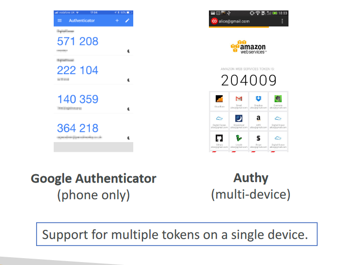
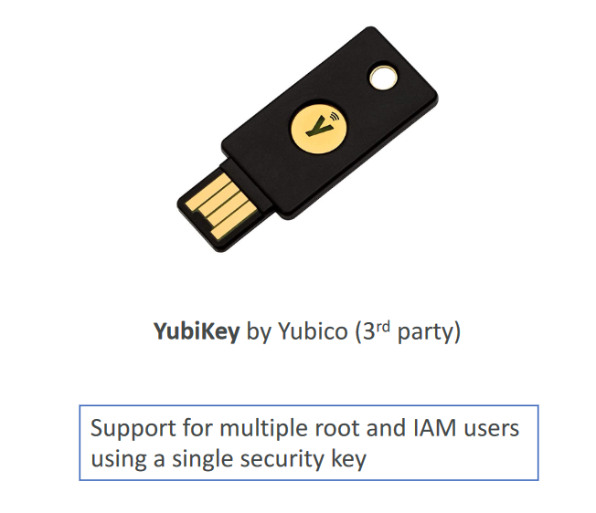
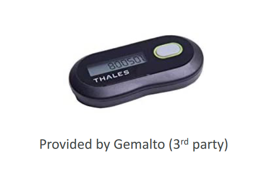
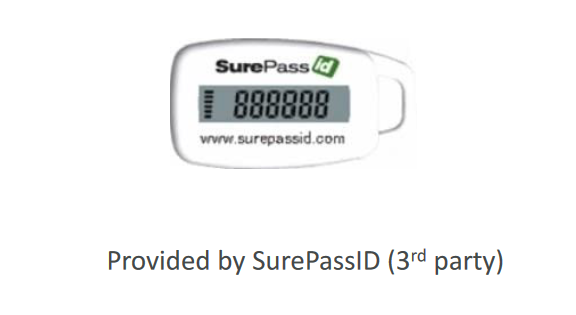

- Strong passwords = higher security for your accou
- In AWS, you can setup a password policy:
  + Set a minimum password length
  + Require specific character types
- Allow all IAM users to change their own passwords
- Require users to change their password after some time (password expiration)
- Prevent password re-use

## Multi Factor Authentication - MFA

- Users have access to your account and can possibly change
configurations or delete resources in your AWS account
- You want to protect your Root Accounts and IAM users
- MFA = password you know + security device you own
- Main benefit of MFA: if a password is stolen or hacked, the account is not compromised

## MFA devices options in AWS

- Virtual MFA device

- Universal 2nd Factor (U2F) Security Key

- Hardware Key Fob MFA Device

- Hardware Key Fob MFA Device for AWS GovCloud (US)

