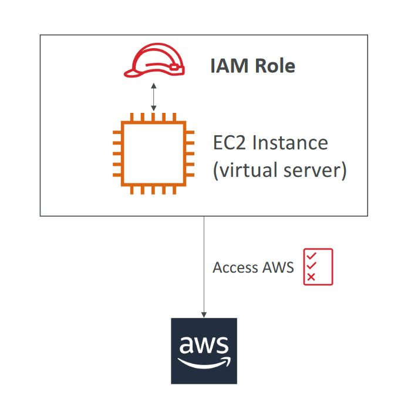

## IAM Roles

- Some AWS service will need to perform actions on your behalf
- To do so, we will assign permissions to AWS services with IAM Roles
- Common roles:
  + EC2 Instance Roles
  + Lambda Function Roles
  + Roles for CloudFormation

## IAM Security Tools
- IAM Credentials Report (account-level)
  + A report that lists all your account's users and the status of their various
    credentials

- IAM Access Advisor (user-level)
  + Access advisor shows the service permissions granted to a user and when those
    services were last accessed.
  + You can use this information to revise your policies.